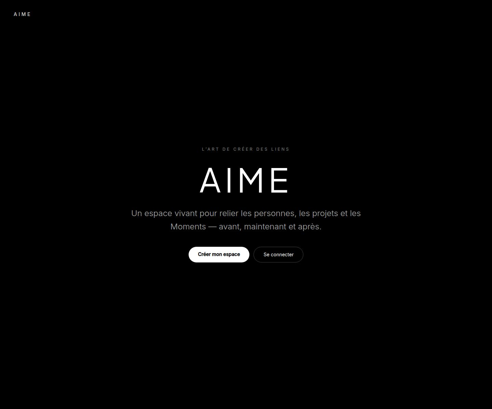
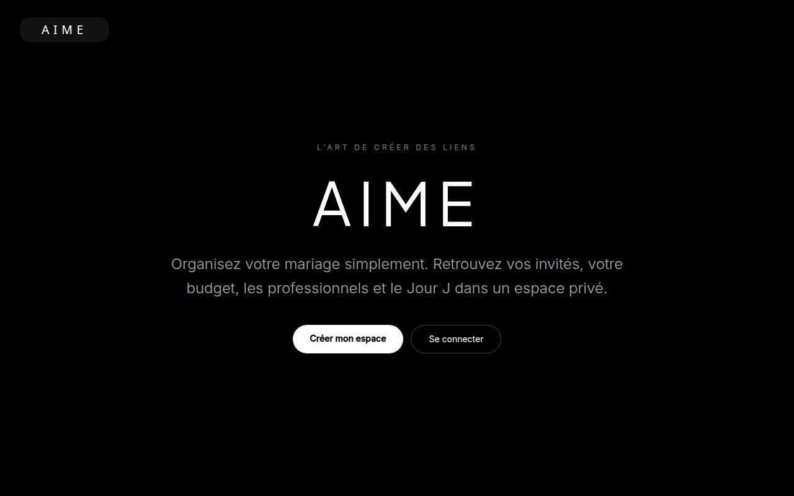

# byaime — le Monde d'un mariage, en une page

> Un mariage est un projet temporel avec des personnes, des prestataires, des
> tâches, des documents, une organisation et de la musique. Tout le reste est
> du bruit. byaime supprime le bruit sans perdre la réalité.

Production : **https://www.byaime.fr** · Constitution et design system :
[AIME-COMPOSER](https://github.com/mattmezstitchlab/AIME-COMPOSER) · Pont
entre les deux dépôts : [`docs/pont-architecture-aime.md`](docs/pont-architecture-aime.md).

## TL;DR architecture

| Principe | Ce que ça veut dire dans le code |
|---|---|
| **1 fichier = 1 mariage** | `WorldProject` est la seule source de vérité (`artifacts/byaime-onepage/src/store/project-store.tsx`). Exportable en `.byaime.json`, réimportable, local-first. |
| **La timeline est la colonne vertébrale** | Chaque Moment porte `time`, `phase` (avant / Jour J / après), `visibility`, `relations`. Prestataires, musique, documents s'y accrochent. |
| **Rail de 7, jamais de doublon** | `wedding-navigation.ts` est une fabrique pure testée : Timeline · Personnes (plan de table inclus) · Prestataires (budget inclus) · Étapes · Galerie · Organisation · Musique. `normalizePanelId` absorbe les anciens identifiants. |
| **La page publique est une composition déclarative** | `publicPage.blocks[]` : un bloc ne stocke qu'une **liaison** vers une source canonique, jamais une valeur. Changer le titre du Monde change la page — effet Ripple vérifié par test. Rien ne devient public par héritage. |
| **Une seule page publique** | `/profil/:projectId` sert le Monde ; `/rsvp/:token` et `/bilan/:id` sont des vues, pas des sites. |
| **API optionnelle** | Sans session ni réseau, l'app tourne en local (`LocalProjectProvider`) ; avec, elle synchronise sur PostgreSQL via `updatedAt` comme jeton optimiste (409 sur écriture périmée, jamais d'écrasement silencieux). |
| **Pas de valeur devinée** | Ce qui n'est pas résolu est nommé : côté produit (sources manquantes annoncées) comme côté juge (diagnostic AIME-COMPOSER, « NON RÉSOLU » jamais compté comme écart). |

Détail et justification de chaque règle : [`ARCHITECTURE_INDISCUTABLE.md`](ARCHITECTURE_INDISCUTABLE.md).

## Lancer

```bash
corepack enable                          # pnpm 10.14.0, épinglé par packageManager
corepack pnpm install --frozen-lockfile  # l'invariant que Vercel vérifie en premier
corepack pnpm --filter @workspace/byaime-onepage run dev     # http://localhost:4173
corepack pnpm --filter @workspace/api-server run dev         # API sur :5000 (DATABASE_URL requis)
```

Sans `VITE_CLERK_PUBLISHABLE_KEY`, l'app démarre en **mode dégradé** : pages
publiques servies, écrans à session remplacés par « Connexion momentanément
indisponible ». Variables d'environnement complètes :
[`docs/vercel-deployment.md`](docs/vercel-deployment.md).

## Vérifier — les gates, dans l'ordre où elles cassent

```bash
corepack pnpm install --frozen-lockfile   # lockfile gelé (ce qui a cassé la prod le 18/09/2026)
corepack pnpm run typecheck               # tous les packages
corepack pnpm test                        # 563 (onepage) + 85 (api) + 33 (domaine) tests
corepack pnpm run verify:vercel           # build Vercel + configs + entrypoints + lockfile
corepack pnpm run e2e                     # Playwright, nécessite Clerk + Postgres
```

`scripts/verify-vercel.mjs` rejoue exactement ce que Vercel fait. Avec
`VERCEL_VERIFY_DEPLOYMENT_URL=https://www.byaime.fr`, il sonde aussi le
déploiement réel (`/api/healthz`, routes protégées : statut **et** JSON).

## Où vivent les choses

```
artifacts/byaime-onepage/   l'app (Vite + React 19 + Tailwind v4) — src/store, src/lib, src/components
artifacts/api-server/       Express 5, Clerk, Resend, App Storage — src/routes/aime.ts porte les rôles
lib/db/                     Drizzle + migrations SQL idempotentes (lib/db/migrations/)
lib/api-spec/               openapi.yaml — le contrat ; codegen → lib/api-client-react, lib/api-zod
lib/aime-domain/            règles métier pures partagées (carte universelle, RSVP)
api/                        entrypoints Vercel — n'importent que artifacts/api-server/dist/app.mjs
docs/                       audits, plans, pont AIME-COMPOSER, déploiement, CI
.agents/memory/             mémoire produit (décisions gravées : Ripple UI, page publique unique…)
```

Règle de circulation avec AIME-COMPOSER : un concept **naît côté COMPOSER**
(spécification avec statut), puis **atterrit ici** en tranche verticale
testée. Jamais l'inverse, jamais en parallèle. byaime est jugé par le
diagnostic universel de COMPOSER comme n'importe quel projet externe — la
convergence se mesure (`--baseline`), elle ne se déclare pas.

## Captures

| Landing | Timeline immersive | Carte réseau |
|---|---|---|
|  |  |  |

## État

`v1.0-local-first` — livraison P0 → P6 (`TODO_FINAL.md`), 681 tests verts,
déployé sur Vercel. Prochaines étapes dans l'ordre du juge :
[`docs/pont-architecture-aime.md`](docs/pont-architecture-aime.md) § 5 et § 10.
